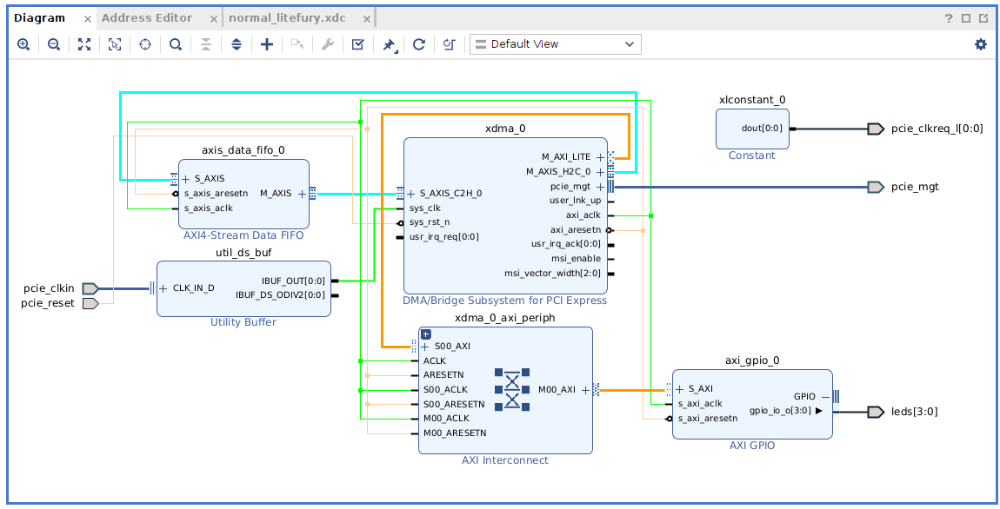
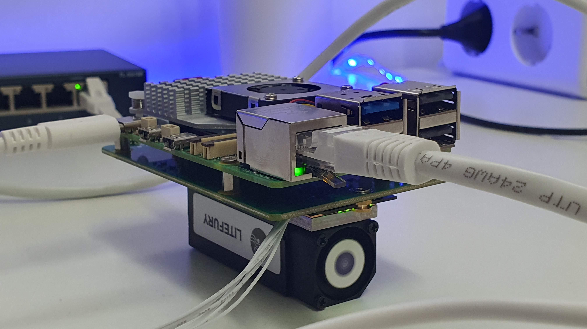

# litefury_rp5

This project uses the [Pineberry HAT Drive Bottom](https://pineberrypi.com/products/hatdrive-bottom-2230-2242-2280-for-rpi5) to connect a Litefury board to the [Raspberry Pi 5](https://www.raspberrypi.com/products/raspberry-pi-5/).

## Folders

- `/2023.2/litefury_rp5`: Vivado project. Vivado version 2023.2
- `/python_nb`: Python Notebook
- `/src`: Constraints.

## Images

